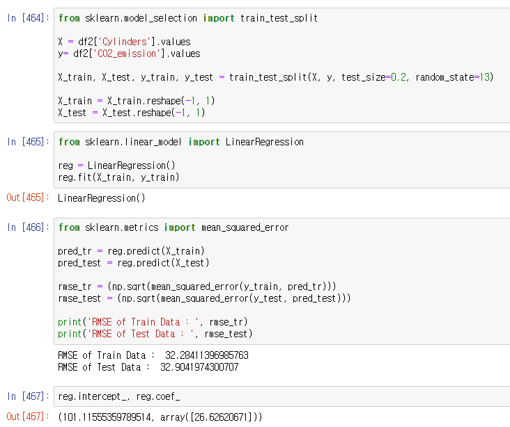

# regression-repo-3

**캐나다 차량 별 CO2 배출**

</img><br/>

# 1. Intro

## 1-1. Topic
- 다양한 기능에 따른 차량의 CO2 배출량

## 1-2. contents
1. EDA
2. regression
3. 성능평가
4. 추가 데이터 예측

## 1-3. Data-set 
-  이 데이터는 차량의 CO2 배출량이 기능에 따라 어떻게 달라질 수 있는지에 대한 세부 정보를 나타냄 약 7 년 동안의 데이터가 포함되었고
총 7385 개의 행과 12 개의 열이 있음
- [kaggle] <https://www.kaggle.com/debajyotipodder/co2-emission-by-vehicles>

## 1-4. roles

- 김도겸 : 데이터 분석, EDA, 모델링, 성능평가, 회귀분석
- 류승환 : EDA, 매개변수 조사, readme 작성, 회귀분석

# 2. Process 

## 2-1. 데이터 import 
```
# 데이터 load
df = pd.read_csv('CO2 Emissions_Canada.csv')

df2 = df.copy()
```

 </

## 2-2. EDA
- CO2 배출량에 대한 histogram

 </
- Heatmap ==> CO2 배출량과의 상관관계 파악

 </
- 생산 회사별 데이터 파악

 </

- heatmap에서 봤을 때, 7,8,9번째 해당하는 column과 CO2 배출량과의 관계는 선형적임 따라서 engine size/ cylinder와 co2 배출량과의 관계를 나타낼 수 있음 그 중 cylinder 갯수와 CO2 배출량과의 관계를 생산 회사별로 비교분석하고자 함

## 2-3. Regression
- 총 cylinders와 CO2 배출량의 관계를 rmse로 나타내고 coef(기울기), intercept(y절편)까지 구함

 </

- 그래프로 나타내고 상위 10개의 회사들도 각각 rmse와 coef, intercept를 구해서 비교하고자 함

 </

 - 그래프로 표현

</

- 상위 10개 회사들의 RMSE,COEF, INTERCEPT를 각각 구하여 비교하고 이로 인해, 회사별 CO2 배출량을 비교분석이 가능해짐

</


# 3. 성능평가
# 4. REVIEW