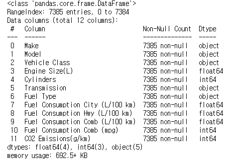
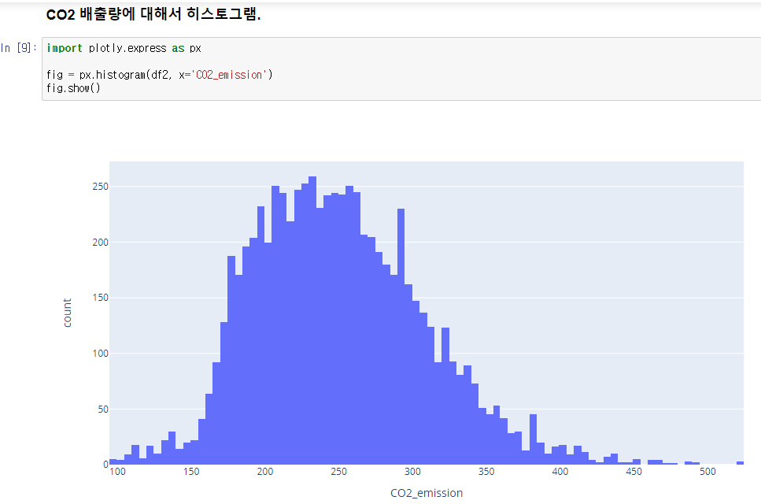
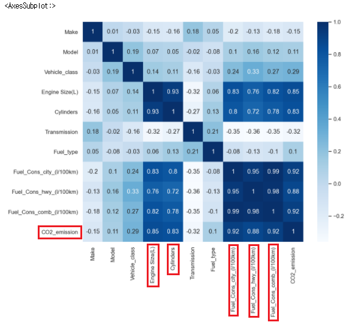
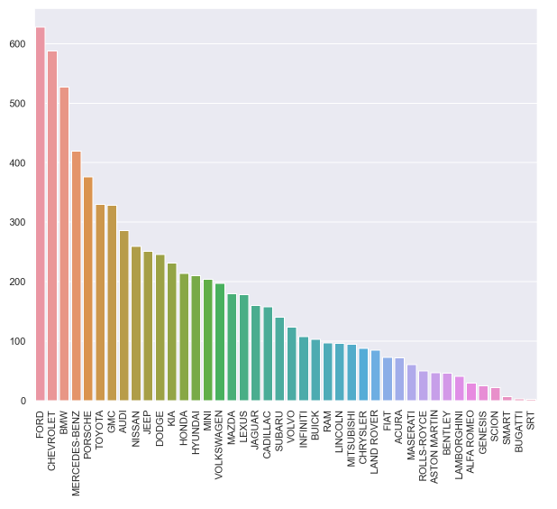
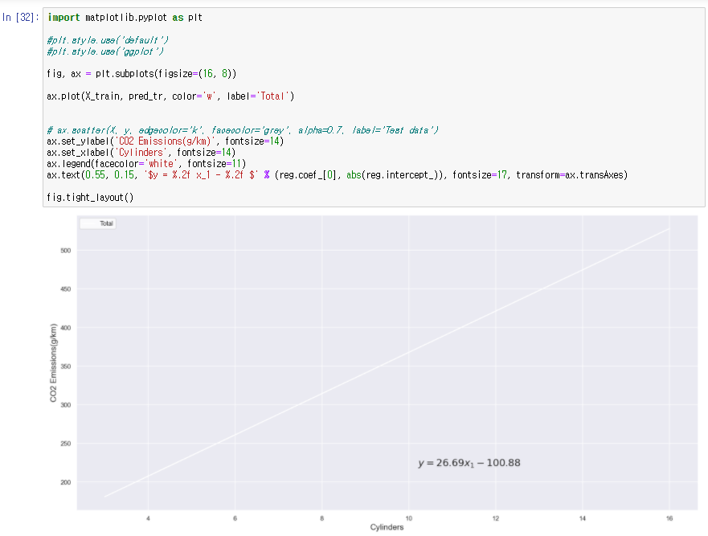
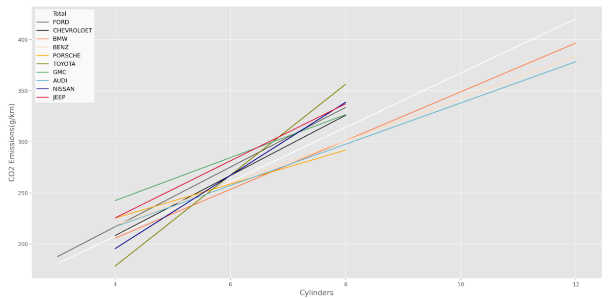

# 캐나다 차량별 CO2 배출 회귀 분석

<br/>

> 차량의 일부 특성만으로 CO2 배출량을 예측해보자!


## 1. Intro
### 1-1. Topic
차량의 특성에 따른 CO2 배출량을 회귀분석한다.

### 1-2. contents
1. EDA
2. Regression
    1. 차량 브랜드별 실린더 수 대비 CO2 배출량 회귀분석
    2. 전체 특성 대비 CO2 배출량 회귀분석(multiple regression)
    3. 변속기, 실린더 수 대비 CO2 배출량 회귀분석(multiple regression)
3. Review

### 1-3. Data-set 
-  데이터는 차량의 특성과 CO2 배출량 값으로 구성. 약 7 년 동안의 데이터로 총 7385 개의 행과 12 개의 열이 있음

- ['CO2 Emission by Vehicles'](https://www.kaggle.com/debajyotipodder/co2-emission-by-vehicles?select=CO2+Emissions_Canada.csv) from kaggle
    - 원본 데이터는 [캐나다 정부 오픈데이터](https://open.canada.ca/data/en/dataset/98f1a129-f628-4ce4-b24d-6f16bf24dd64#wb-auto-6)에서 제공
### 1-4. roles

- [김도겸](https://github.com/dockyum) : EDA, 회귀분석(2,3), 발표자료 제작 (p17~), readme 최종 작성
- [류승환](https://github.com/ryuseunghwan1) : EDA, 회귀분석(1), 발표자료 제작 (~p16), readme 작성

## 2. EDA 
### data
```
df = pd.read_csv('./data/CO2 Emissions_Canada.csv')
df.info()
```

 

### 특성
- Make : 브랜드
- Model : 모델 이름
- Vehicle Class : 차량 타입 (Compact, suv, mid-size, two-seater 등)
- Engine Size(L) : 엔진 크기
- Cylinders : 실린더 수
- Transmission : 변속기 타입 (Auto, Auto manual, Auto with select shift 등)
- Fuel Type : 기름 종류 (gasoline, Diesel, Ethanol 등)
- Fuel Consumption City (L/100 km) : 시내에서의 100km 당 기름 소비
- Fuel Consumption Hwy (L/100 km) : 고속도로에서의 100km 당 기름 소비
- Fuel Consumption Comb (L/100 km) : 시내 50, 고속도로 50 비율로 섞은 기름 소비
- Fuel Consumption Comb (mpg) : 연비 (mile per gram)
- **CO2 Emissions(g/km)** : km 당 CO2 배출량 *label*

### histogram - CO2 배출량
label의 분포 확인

 

### Heatmap
'CO2 배출량'과 관계가 높은 feature 파악

 

- Fuel Consumption 관련 특성과 Cylinder, Engine Size가 큰 영향.

### 생산 회사별 데이터 수

 

- 차종이 많은 브랜드가 데이터가 많다. 

### Cylinder에 따른 CO2 배출량 - Transmission Type 별로


- 실린더가 크면 CO2 배출량이 커진다. 단, AV(cvt 변속기)는 주로 배출량이 낮고 A(오토)의 경우 배출량이 높은 경향을 보인다.

## 3. Regression
### 3-1. 차량 브랜드별 실린더 수 대비 CO2 배출량 회귀분석
실린더가 커질수록 CO2 배출은 많아지지만 그 분포는 브랜드마다 차이가 큼. 더 구체적인 추정을 하기 위해 각 브랜드별로 회귀 모델을 구한다. \
데이터 수 상위 10개 브랜드의 cylinders와 CO2 배출량의 관계를 회귀분석하고 rmse, coef(기울기), intercept(y절편)를 구하여 비교한다. 

#### 1. 전체 브랜드의 실린더별 CO2 배출량 회귀 모델

 

#### 2. 상위 10개 브랜드의 실린더별 CO2 배출량 회귀 모델



#### 3. 상위 10개 회사들의 회귀 모델 비교

- 각 회귀 모델의 RMSE,COEF, INTERCEPT를 비교하여 브랜드별 CO2 배출량 모델을 비교분석 한다
- BMW, PORSCHE, AUDI, JEEP은 실린더와 CO2 배출량 회귀모델이 다른 브랜드에 비해 선형적이다(표준편차가 작다)
- GMC는 평균 30g/km 정도 많은 배출량을 자랑한다
- TOYOTA는 저가 모델에서는 CO2 배출량이 절반정도이나 실린더가 많으면 크게는 평균 50g/km 이상의 배출량울 낸다


### 3-2. 전체 특성 대비 CO2 배출량 회귀분석
다중회귀분석

#### 1. 데이터 전처리

- 범주가 많은 특성(make, model) 제거  
- 범주형 데이터 원핫인코딩

    ```python
    data_with_dummies = data_reg.copy()

    col_to_1hot = ['Vehicle Class','Transmission','Fuel Type','Cylinders']
    prfix_1hot = ['V-Cls', 'Trans', 'Fl-T','Cyl']

    for col, pfx in zip(col_to_1hot, prfix_1hot):
        fuel_1hot = pd.get_dummies(data_reg[col], prefix=pfx, drop_first=True)
        data_with_dummies = data_with_dummies.join(fuel_1hot)
    ```

#### 2. LinearRegression
- score 0.99 : 과적합 의심

    

- `Fuel Consumption`과 `CO2 Emissions`이 강한 선형관계 -> **EDA를 꼼꼼하게 하자**

    

#### 3. 종속이 강한 특성 제거 후 LinearRegression
- 'Fuel Consumption Hwy (L/100 km)','Fuel Consumption Comb (L/100 km)','Fuel Consumption Comb (mpg)','Fuel Consumption City (L/100 km)' 제거
- RMSE of Train : 22.2 , Test : 22.86 / Score of Train: 0.8555 , Score of Test: 0.8492

    

#### 4. 다양한 Regressors
- KNeighborsRegressor \
RMSE of Train : 15.06 , Test : 17.97 / Score of Train: 0.9335 , Score of Test: 0.9068
- DecisionTreeRegressor \
RMSE of Train : 12.58 , Test : 15.65 / Score of Train: 0.9536 , Score of Test: 0.9293
- RandomForestRegressor \
RMSE of Train : 12.77 , Test : 15.37 / Score of Train: 0.9522 , Score of Test: 0.9318

### 3-3. 변속기, 실린더 수 대비 CO2 배출량 회귀분석
2개의 특성만으로 회귀분석

#### 1. 전처리

- `Transmission` 특성의 변속기 타입과 숫자 분리

    

- 변속기 타입 컬럼 onehotencoding
- `Cylinders` 특성 추가한 df 생성

    

#### 2. LinearRegression
- RMSE of Train : 30.14 , Test : 31.18 / Score of Train: 0.7316 , Score of Test: 0.7232

## 4. REVIEW
1. EDA를 꼼꼼히 해야 ML 계획 및 방향을 잘 세울 수 있겠다. 가능성이 있는 몇 개의 체크리스트를 가지는 것도 좋겠다는 생각.
    > 기본적으로 데이터에는 오류가 있다는 자세로 접근할 필요가 있다. 전체 데이터 중 사용할 수 없는 데이터를 먼저 찾아내자.
    > matplotlib에서 제공하는 plot 마다 명확한 목적이 있다. categorical data의 분포는 scatterplot을 쓴다는 둥. 공부가 더 필요하다.

2. 도출한 모델이 신뢰 가능한 지 질문하는 자세가 필요하다. 내가 만든 모델이 잘 만들어졌다고 어떻게 논리적으로 설명할 수 있을까?
    > ML에서는 설명력도 중요하다.

----
project from [Fast campus Datascience School](https://github.com/dss-16th)
