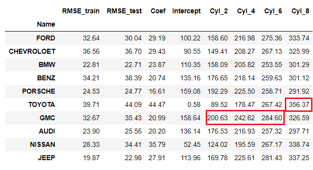

# 캐나다 차량 별 CO2 배출 회기 분석

<br/>

# 1. Intro
## 1-1. Topic
차량 모델, 종류, 엔진 크기, co2 배출량 등의 특성(feature)이 있는 데이터를 활용, 차량의 특성에 따른 CO2 배출량을 회기분석한다.

## 1-2. contents
1. EDA
2. Regression
    1. 차량 브랜드 별 실린더 수 대비 CO2 배출량 회기분석
    2. 전체 특성 대비 CO2 배출량 회기분석(multiple regression)
    3. 변속기, 실린더 수 대비 CO2 배출량 회기분석(multiple regression)
3. REVIEW
4. 

## 1-3. Data-set 
-  데이터는 차량의 CO2 배출량이 기능에 따라 어떻게 달라질 수 있는지에 대한 세부 정보를 나타냄 약 7 년 동안의 데이터가 포함되었고 총 7385 개의 행과 12 개의 열이 있음

- ['CO2 Emission by Vehicles'](https://www.kaggle.com/debajyotipodder/co2-emission-by-vehicles?select=CO2+Emissions_Canada.csv) from kaggle
    - 원본 데이터는 [캐나다 정부 오픈데이터](https://open.canada.ca/data/en/dataset/98f1a129-f628-4ce4-b24d-6f16bf24dd64#wb-auto-6)에서 제공
## 1-4. roles

- 김도겸 : EDA, 회귀분석(2,3), 발표자료 제작 (p17~), readme 작성
- 류승환 : EDA, 회귀분석(1), 발표자료 제작 (~p16), readme 작성

# 2. EDA 
### data
```
df = pd.read_csv('./data/CO2 Emissions_Canada.csv')
df.info()
```

 

### 특성
- Make : 브랜드
- Model : 모델 이름
- Vehicle Class : 차량 타입 (Compact, suv, mid-size, two-seater 등)
- Engine Size(L) : 엔진 크기
- Cylinders : 실린더 수
- Transmission : 변속기 타입 (Auto, Auto manual, Auto with select shift 등)
- Fuel Type : 기름 종류 (gasoline, Diesel, Ethanol 등)
- Fuel Consumption City (L/100 km) : 시내에서의 100km 당 기름 소비
- Fuel Consumption Hwy (L/100 km) : 고속도로에서의 100km 당 기름 소비
- Fuel Consumption Comb (L/100 km) : 시내 50, 고속도로 50 비율로 섞은 기름 소비
- Fuel Consumption Comb (mpg) : 연비 (mile per gram)
- **CO2 Emissions(g/km)** : km 당 co2 배출량 *label*

### CO2 배출량에 대한 histogram
label의 분포 확인

 

### Heatmap ==> CO2 배출량과의 상관관계 파악

 

### 생산 회사별 데이터 수

 

- heatmap에서 봤을 때, 7,8,9번째 해당하는 column과 CO2 배출량과의 관계는 선형적임 따라서 engine size/ cylinder와 co2 배출량과의 관계를 나타낼 수 있음 그 중 cylinder 갯수와 CO2 배출량과의 관계를 생산 회사별로 비교분석하고자 함

# 3. Regression
## 3-1. 차량 브랜드 별 실린더 수 대비 CO2 배출량 회기분석
실린더가 커질수록 CO2 배출은 많아지지만 그 분포는 브랜드마다 차이가 큼. 더 구체적인 값을 얻기 위해 각 브랜드 별로 CO2 배출량을 추정하는 회기분석 모델을 구한다. \
데이터 수 상위 10개 브랜드의 cylinders와 CO2 배출량의 관계를 회기분석하고 rmse, coef(기울기), intercept(y절편)를 구하여 비교한다. 

1. 먼저 전체 브랜드의 실린더 별 CO2 배출량 회기분석 모델을 구한다

 

2. 상위 10개 브랜드의 실린더 별 CO2 배출량 회기분석 모델을 구한다


3. 상위 10개 회사들의 회기분석 모델의 RMSE,COEF, INTERCEPT를 비교하여 브랜드별 CO2 배출량 모델을 비교분석 한다
    - BMW, PORSCHE, AUDI, JEEP은 실린더와 CO2 배출량 회귀모델이 다른 브랜드에 비해 선형적이다(표준편차가 작다)
    - GMC는 평균 30g/km 정도 많은 배출량을 자랑한다
    - TOYOTA는 저가 모델에서는 CO2 배출량이 절반정도이나 실린더가 많으면 크게는 평균 50g/km 이상의 배출량울 낸다




## 3-2. 전체 특성 대비 CO2 배출량 회기분석


## 3-3. 변속기, 실린더 수 대비 CO2 배출량 회기분석
# 4. REVIEW
1. 2-3에서 첫번째 regression시 cylinders와 Co2 배출량과의 상관관계를 각 회사마다 rmse,coef,intercept를 각각 구해서 비교해봤는데 Engine Size도 같이 넣어서 구해보고, 따로 구해보기도 하면서 각 모델들을 비교해볼 예정
2. 
